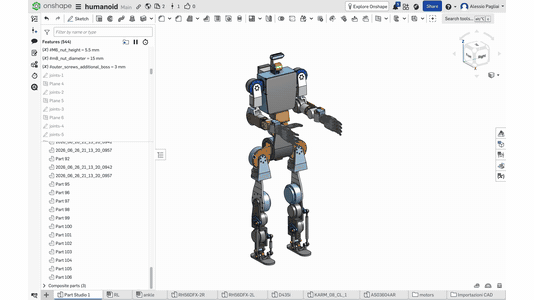

# primo 

Open source humanoid robot. 3D printed structure, 30 RobStride quasi-direct-drive actuators, NVIDIA Jetson AGX Thor, Unitree G1 kinematics as reference. Still in design, not built yet: shared now so it can be built together.

[CAD on Onshape](https://cad.onshape.com/documents/2a6d830c153f862229ff478f/w/82c50406ffe66995476ba0a1/e/6ac57dbaf03b523effa40409) · [BOM](bom/bom.xlsx) · [Electrical scheme](electrical/scheme.md) · [Printable STL](cad/stl/) · [URDF](sim/urdf/primo.urdf) · [Simulation](sim/) · [Design notes](docs/) · [River Family](https://riverfamily.art/)

[▶ Video in 4K](https://youtu.be/6nTcHpFmKbQ) · [Download the whole folder](https://storage.googleapis.com/riverfamily/primo/primo.zip) · [Start here to continue the project, also with an AI](AGENTS.md)

## Numbers

- height ≈ 1.40 m, purchased mass 33 kg, finished estimate ≈ 45 kg
- 30 DoF: legs 6 + 6, arms 7 + 7, waist 2, neck 2
- ankle: two motors in the shin, two pushrods, offset gimbal — pitch is the sum, roll the difference
- actuators, all RobStride QDD: RS04 ×6 hips and knees, RS03 ×3 waist roll and hip yaw¹, RS06 ×11 ankles, waist yaw, shoulders, elbows, RS00 ×8 shoulder yaw and wrists, RS05 ×2 neck
- power: 48 V 13S2P Li-ion 421 Wh, 24 V rail for computer and hands, hardware e-stop with precharge
- compute: Jetson AGX Thor, 5 CAN buses at 1 Mbps, RealSense D436, pelvis IMU
- hands: Inspire RH56DFX, an own 15-DoF hand is in development ([docs/hand-design.md](docs/hand-design.md))
- structure: PA-CF / PPA-CF, Bambu Lab H2C, 0.4 nozzle
- cost: ≈ EUR 30 000 all new; ≈ EUR 10 300 if Thor and hands are already owned

¹ hip yaw: the CAD currently mounts RS06, the BOM RS03. Decided by simulation before ordering the legs.

## Build order

| Phase | Content | EUR incl. VAT |
|---|---|---:|
| 1 | right arm, right hand, one ankle kit, battery, safety chain, torso on a table | 4 009 |
| 2 | legs and locomotion | 3 998 |
| 3 | left arm, waist, neck, audio, mobile | 2 258 |

Filter the `Phase` column in [bom/bom.xlsx](bom/bom.xlsx). Every row has supplier, link, mass and notes. Thor and hands are counted at zero because they are owned; reference prices are in the notes.

## Files

| Folder | Content |
|---|---|
| [bom/](bom/) | `bom.xlsx` 108 active rows, `bom.csv`, `build_bom.py` generator |
| [electrical/](electrical/) | connection scheme, written and drawn |
| [cad/](cad/) | Onshape link, printable STL of the structure, first 3MF files, RobStride FeatureScript |
| [cad/bonegen/](cad/bonegen/) | generated bones: a bone is grown by topology optimisation between the screw holes of two motors, clear of everything that moves. Thigh pilot, plan for the whole robot |
| [sim/](sim/) | URDF with meshes, mirror pipeline, ankle transmission map |
| [sim/isaaclab/](sim/isaaclab/) | walking: trained policy, Isaac Lab task code, how it was reached round by round, traps, results, next steps |
| [docs/](docs/) | why RobStride and not Encos or CubeMars, actuator tables, hand design, references, AI handoffs and working memory |
| [AGENTS.md](AGENTS.md) | entry point to continue the project, for people and AI agents |

What is printed is in `cad/stl/`. What is bought — motors, hands, battery, computer, camera, pushrods, screws — is in the BOM.

## Simulation

The right side and the centre are modelled in Onshape; `sim/mirror_urdf.py` mirrors them into the full 30-joint URDF with masses, limits and collisions: [sim/urdf/primo.urdf](sim/urdf/primo.urdf).

Walking is trained in Isaac Sim 5.1 / Isaac Lab 2.3.2 with RSL-RL PPO, on rough terrain with stairs of 5–23 cm: 12 leg joints + waist roll, mean knee flexion 36°, about 87 % of a 1000-step episode survived. Everything is in [sim/isaaclab/](sim/isaaclab/): the policy `kneehard_model_2999.pt` with the exact parameters it was trained with, the task code, the diagnostic scripts, the [story round by round](sim/isaaclab/HANDOFF.md), the [traps](sim/isaaclab/LESSONS.md), the [measured results](sim/isaaclab/RESULTS.md) and the [next steps](sim/isaaclab/NEXT_STEPS.md).

It is at 2:06 of the [video](https://youtu.be/6nTcHpFmKbQ). Clips: [KneeHard, the chosen policy](https://storage.googleapis.com/riverfamily/primo/videos/walk-kneehard.mp4) · [KneeTorque](https://storage.googleapis.com/riverfamily/primo/videos/walk-kneetorque.mp4).

## Motors

All RobStride, after comparing Encos (the motors of the Asimov robot), CubeMars, Steadywin, MyActuator, ZeroErr and Dynamixel. Encos is smaller and lighter at the same torque, but its 25–36:1 reduction gives up backdrivability and force control for good, worst on the ankle, and it is sold on quotation without public CAD. The comparison and the reasons: [docs/motor-selection.md](docs/motor-selection.md), every number in [docs/actuator-tables.md](docs/actuator-tables.md). Standard modules against custom actuators whose housing is the bone, and how a later version could get there: [docs/actuator-integration.md](docs/actuator-integration.md).

## Open points

- nothing built yet: phase 1 is the first bench
- before ordering: battery shipping to Italy and BMS limits, real ankle crank geometry, hip yaw motor — measure its torque while turning in simulation, RS06 36 Nm or RS03 60 Nm ([how](sim/isaaclab/NEXT_STEPS.md))
- walking policy: no pushes, no domain randomisation and arms held still so far; not yet ready for the real robot
- ankle torque map is derived from the CAD export and still to be verified
- e-stop does not cut hand power: decide whether it should
- STL are exported from the design state, not print-validated
- the CAD femur touches the shank assembly from about 123° of knee flexion (URDF limit 165°): decide the real joint limits ([cad/bonegen/](cad/bonegen/))
- generated bones are a pilot with assumed loads: next, loads logged from the walking policy and 2 mm resolution

## Also on

[Printables](https://www.printables.com/model/1846831) · [Thingiverse](https://www.thingiverse.com/thing:7411626) · [Cults](https://cults3d.com/en/3d-model/gadget/primo-open-source-humanoid) · [MakerOnline](https://www.makeronline.com/en/model/primo%20open%20source%20humanoid/331171.html) · [YouTube](https://youtu.be/6nTcHpFmKbQ) · [riverfamily.art](https://riverfamily.art/#primo)

## Licence

[CC0 1.0](LICENSE.md). One exception: the task code in `sim/isaaclab/code/` derives from Isaac Lab and keeps its [BSD-3-Clause licence](sim/isaaclab/code/LICENSE). Vendor files are not redistributed as CAD: motor and hand STEP files, manuals and the Unitree URDF are linked from [docs/references.md](docs/references.md).
