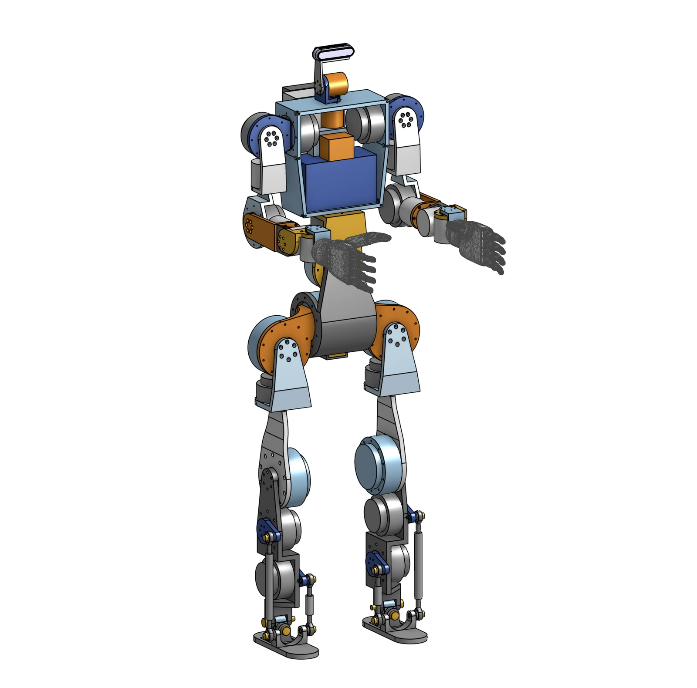

# umanoide

Open source humanoid. 3D printed structure, 30 RobStride quasi-direct-drive actuators, NVIDIA Jetson AGX Thor, Unitree G1 kinematics as reference. Still in design, not built yet: shared now so it can be built together.

[CAD on Onshape](https://cad.onshape.com/documents/2a6d830c153f862229ff478f/w/82c50406ffe66995476ba0a1/e/6ac57dbaf03b523effa40409) · [BOM](bom/bom.xlsx) · [Electrical scheme](electrical/scheme.md) · [Simulation](sim/) · [Design notes](docs/) · [River Family](https://riverfamily.art/)

[▶ CAD tour on YouTube](https://youtu.be/bHGGjXYELUE)

## Numbers

- height ≈ 1.40 m, purchased mass 33 kg, finished estimate ≈ 45 kg
- 30 DoF: legs 6 + 6, arms 7 + 7, waist 2, neck 2
- ankle: two motors in the shin, two pushrods, offset gimbal — pitch is the sum, roll the difference
- actuators, all RobStride QDD: RS04 ×6 hips and knees, RS03 ×3 waist roll and hip yaw¹, RS06 ×11 ankles, waist yaw, shoulders, elbows, RS00 ×8 shoulder yaw and wrists, RS05 ×2 neck
- power: 48 V 13S2P Li-ion 421 Wh, 24 V rail for computer and hands, hardware e-stop with precharge
- compute: Jetson AGX Thor, 5 CAN buses at 1 Mbps, RealSense D436, pelvis IMU
- hands: Inspire RH56DFX, an own 15-DoF hand is in development ([docs/hand-design.md](docs/hand-design.md))
- structure: PA-CF / PPA-CF, Bambu Lab H2C, 0.4 nozzle
- cost: ≈ EUR 30 000 all new; ≈ EUR 10 300 if Thor and hands are already owned

¹ hip yaw: the CAD currently mounts RS06, the BOM RS03. Decided by simulation before ordering the legs.

## Build order

| Phase | Content | EUR incl. VAT |
|---|---|---:|
| 1 | right arm, right hand, one ankle kit, battery, safety chain, torso on a table | 4 009 |
| 2 | legs and locomotion | 3 998 |
| 3 | left arm, waist, neck, audio, mobile | 2 258 |

Filter the `Phase` column in [bom/bom.xlsx](bom/bom.xlsx). Every row has supplier, link, mass and notes. Thor and hands are counted at zero because they are owned; reference prices are in the notes.

## Files

| Folder | Content |
|---|---|
| [bom/](bom/) | `bom.xlsx` 108 active rows, `bom.csv`, `build_bom.py` generator |
| [electrical/](electrical/) | connection scheme, written and drawn |
| [cad/](cad/) | Onshape link, first 3MF files, RobStride FeatureScript |
| [sim/](sim/) | URDF pipeline, ankle transmission map, Isaac Lab notes |
| [docs/](docs/) | hand design, actuator tables, references, AI handoffs |

## Simulation

The right side and the centre are modelled in Onshape; `sim/mirror_urdf.py` mirrors them into the full 30-joint URDF with masses, limits and collisions. Ready package: [umanoide-urdf.zip](https://storage.googleapis.com/riverfamily/umanoide/umanoide-urdf.zip) (12 MB, URDF + meshes + Isaac notes).

CAD tour: [YouTube](https://youtu.be/bHGGjXYELUE) · [full resolution](https://storage.googleapis.com/riverfamily/umanoide/videos/cad-tour.mov)

Walking in Isaac Lab on rough terrain: [video 1](https://storage.googleapis.com/riverfamily/umanoide/videos/walk-kneehard.mp4) · [video 2](https://storage.googleapis.com/riverfamily/umanoide/videos/walk-kneetorque.mp4)

## Open points

- nothing built yet: phase 1 is the first bench
- before ordering: battery shipping to Italy and BMS limits, hip yaw motor, real ankle crank geometry
- ankle torque map is derived from the CAD export and still to be verified
- e-stop does not cut hand power: decide whether it should

## Follow

[Printables](https://www.printables.com/@River_Family/models) · [MakerWorld](https://makerworld.com/it/@RiverFamily) · [Thingiverse](https://www.thingiverse.com/RiverFamily/designs) · [YouTube](https://www.youtube.com/@art.riverfamily) · [riverfamily.art](https://riverfamily.art/)

## Licence

[CC0 1.0](LICENSE.md). Vendor files are not redistributed: motor CAD and manuals, hand CAD, Unitree URDF are linked from [docs/references.md](docs/references.md).
